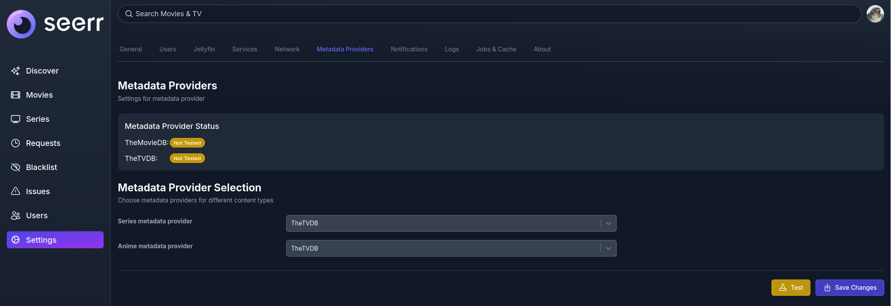
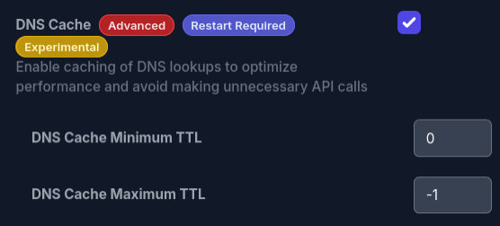

We're excited to announce a major update: the Jellyseerr and Overseerr teams are officially merging into a single team called **Seerr**. This unification marks an important step forward as we bring our efforts together under one banner.

For users, this means one shared codebase combining all existing Overseerr functionalities with the latest Jellyseerr features, along with Jellyfin and Emby support, allowing us to deliver updates more efficiently and keep the project moving forward.

Please check how to migrate to Seerr in our [migration guide](https://docs.seerr.dev/migration-guide) and stay tuned for more updates on the project!

<!--truncate-->

## What's new in Seerr for Overseerr users

Seerr brings several features that were previously available in Jellyseerr but missing from Overseerr. These additions improve flexibility, performance, and overall control for admins and power users:

* **Alternative media solution:** Added support for Jellyfin and Emby as alternatives to Plex. Only one integration can be used at a time.
* **PostgreSQL support**: In addition to SQLite, you can now opt in to using a PostgreSQL database.
* **Blocklist for movies, series, and tags**: Allows permitted users to hide movies, series, or tags from regular users.
* **Override rules**: Adjust default request settings based on conditions such as user, tag, or other criteria.
* **TVDB metadata**: Option to use TheTVDB metadata for series (as in Sonarr) instead of TMDB.
* **DNS caching**: Reduces lookup times and external requests, especially useful when using systems like Pi-Hole/Adguard Home.
* **Helm chart included**: Enables easier installation and maintenance in Kubernetes environments.
* **ntfy.sh notifications**: Support for sending notifications via ntfy.sh.
* **Disable special seasons:** Adds a setting to prevent special seasons from being shown or requested.
* **New languages**: Turkish and Basque

## What's new since the previous Jellyseerr release

This release also brings several important improvements and long-requested features, including **TheTVDB metadata support**, **DNS caching**, and **dynamic webhook placeholders**, along with a few quality-of-life improvements for developers and users alike.

### PNPM v10 Upgrade

We're updating Seerr to **PNPM v10** to keep up-to-date development tools. If you are building Seerr from source or if you contribute to Seerr, you'll need to **update your local PNPM installation** before working on the project.

This doesn't concern you if you're using Docker.

To update, run the following command:
`pnpm self-update`

After updating, verify your version with:
`pnpm -v`

You should see version **10.x.x**.

### TVDB Metadata Provider (Experimental)

We're excited to introduce support for **TheTVDB** as a new metadata provider!
Previously, Seerr relied solely on **TMDB** for movie and TV show information, which sometimes led to discrepancies in season and episode numbering when working with **Sonarr**, since Sonarr uses **TheTVDB** as its metadata source.

With this new integration, Seerr can now use **the same data source as Sonarr** for series and anime, ensuring consistent and accurate season and episode information across both platforms.

You can try this new experimental feature in the new “Metadata Providers” tab of the settings page:

### DNS Caching (Experimental)

By default, Node.js doesn't cache any DNS requests. Our DNS cache manager addresses the problems caused by extremely high DNS query rates, particularly for large Jellyfin libraries as each HTTP request was also resulting in another DNS request. Therefore, by caching these DNS lookups, **Seerr will now reduce stress on DNS servers** and avoid rate-limiting or blocks encountered with services like **Pi-Hole**/**Adguard Home**.

We will post another blog post soon on all the issues we encountered with DNS caching in Node.js.

You can enable this by checking the “DNS Cache” setting in the network tabs of the Seerr settings:

### AniDB for Jellyfin Libraries

This new version also brings additional metadata to Jellyfin-managed collections. When there's no provider ID from TMDB or TVDB, Seerr will automatically **fall back on AniDB**, expanding coverage for lesser-known or region-specific anime.

### Dynamic Placeholders in Webhook URLs

Webhook notifications are now more powerful and adaptable with **dynamic placeholder support in webhook URLs**. This allows Seerr to automatically replace placeholders in the webhook URL with real values at runtime.

For example, you can include the requester's username directly in your webhook URL to better integrate with third-party services or user-specific endpoints.

This feature can be enabled from the **Notifications** settings page, where available placeholders are listed for reference. It's currently marked as **experimental**, and we welcome community feedback to help refine and expand support for additional placeholders in future releases.

### Optional Images in Notifications

Another small feature: **images in notifications are now optional** (but still enabled by default). Previous versions always included images in notifications, which could lead to broken links or failed requests if images were missing or unavailable.

### Security improvement

Some outdated dependencies have been updated (some work is still in progress). Helm charts and containers are now cryptographically signed and can be verified and enforced client-side. Containers now run as rootless. Workflows have been completely reworked to minimize third-party actions. Permissions have been strengthened, and actions are now pinned to specific hashes for better traceability. The release process has been updated to remove many outdated and plugin dependencies, replacing them with more standard industry solutions.

:::important
## Note for PostgreSQL users (optional)

If you're migrating Postgres from version 17 to 18 in Docker, note that the data mount point has changed. Instead of using `/var/lib/postgresql/data`, the correct mount path is now `/var/lib/postgresql`. This update of the mount point is required to ensure the container functions correctly after the upgrade.
:::

## Conclusion

Seerr is built and maintained by dedicated volunteer contributors, whose skills and commitment make it all possible. Many thanks to everyone who contributed to this version:

* [0xsysr3ll](https://github.com/0xSysR3ll)
* [ale183](https://github.com/ale183)
* [Brandon Cohen](https://github.com/OwsleyJr)
* [Disparate2761](https://github.com/Disparate2761)
* [fallenbagel](https://github.com/fallenbagel)
* [Gauthier](https://github.com/gauthier-th)
* [Gauvain](https://github.com/Gauvino)
* [Georgy](https://github.com/tarasverq)
* [Ishan Jain](https://github.com/ishanjain28)
* [James Kruger](https://github.com/theGunner295)
* [Joe Harrison](https://github.com/sudo-kraken)
* [J. Winters-Brown](https://github.com/ofgrenudo)
* [Ludovic Ortega](https://github.com/M0NsTeRRR)
* [RolliePollie18](https://github.com/RolliePollie18)
* [Ryan Cohen](https://github.com/sct)
* [salty](https://github.com/saltydk)
* [samohtxotom](https://github.com/samohtxotom)
* [Sergii Bogomolov](https://github.com/sbogomolov)
* [Someone](https://github.com/InterN0te)
* [TacoCake](https://github.com/TacoCake)
* [Terry Sposato](https://github.com/tsposato)
* [TheCatLady](https://github.com/TheCatLady)
* [Thibaut Noah](https://github.com/tirrorex)
* [THOMAS B](https://github.com/TOomaAh)

Keep an eye on our blog for in-depth looks at our work and upcoming releases!
